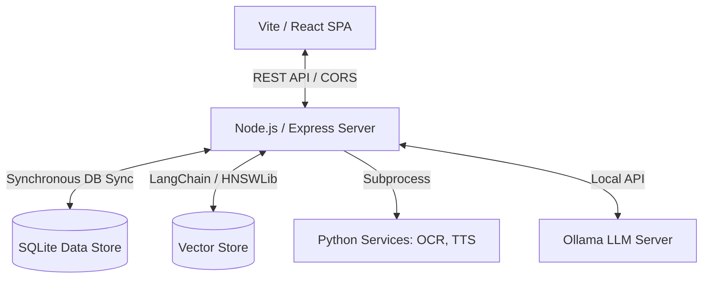

# SurvivalOS (Survival Operations System)

<p align="center">
  
</p>
SurvivalOS is a local-first, off-grid command center designed for emergency preparedness, offline library resource indexing, inventory management, and tactical mission coordination. Built to run on minimal hardware in zero-connectivity environments, it integrates semantic search, local text-to-speech, rules-based safety auditing, and a structured operations center.

---

## Key Core Modules

### 🗺️ Tactical Command & Operations
*   **Active Mission Control**: Launch structured missions from templates (e.g., *Foraging & Hydration*, *Structural Fire Response*, *Communications Outage*) or custom parameters. Track objectives and events on a live timeline.
*   **Tactical Map Panel**: Browse local offline topographic tiles and pinpoint survival coordinates. Plugs directly into local Leaflet assets with zero internet requirements.
*   **EBG Semantic Telemetry**: Monitors local telemetry and observations (e.g., soil moisture, battery levels) mapped onto a rules-based spreading activation simulator to alert operators when goals or survival safety conditions are threatened.
*   **Mission Briefing Exporter**: Generates structured markdown and JSON reports documenting mission execution, notes, and resource consumption.

### 📚 Local Data Core & Neural Index
*   **R.A.N.G.E.R. Conversational Assistant**: Offline RAG (Retrieval-Augmented Generation) query system using local LLMs (Ollama) to extract survival guidelines, search manuals, and guide task steps without leaking data to external APIs.
*   **Content Gap Analyzer**: Scans local documents and maps library completion status against survival milestones (e.g., First Aid, Water Harvesting, Animal Husbandry).
*   **Manual Import Approval Ledger**: A structured governance dashboard to review staging files, log licensing/validity evidence, and authorize documents before indexing them into the neural data store.
*   **OCR Scanning Tool**: Integrated PyMuPDF & local OCR extraction scripts to digitize scanned documents directly into full-text formats.

### 🥫 Resource & Inventory Management
*   **Water Reserve Calculator**: Audits local water containers, tracks daily consumption limits, and projects storage runtime survival metrics.
*   **Pantry Tracker & Recipe Wizard**: Manages pantry items, checks calorie reserves, and suggests cookable recipes based on current ingredients.

---

## System Architecture



*   **Frontend SPA**: Single-page React application compiled using Vite, featuring a dark-mode theme, Leaflet maps, and an interactive command interface.
*   **Backend Server**: Node.js API server using `node:sqlite`'s `DatabaseSync` for ACID-compliant metadata storage, plus LangChain community loaders for full-text vector storage.
*   **Python Sidecars**: Supporting subprocesses for Optical Character Recognition (OCR) and high-quality local neural Text-to-Speech (TTS) utilizing ONNX runtimes.
*   **LLM Connection**: Local Ollama instance serving `llama3.1:8b` for RAG reasoning and `nomic-embed-text` for semantic text embedding.

---

## Safety, Portability & Local-First Boundaries

1.  **Strictly Offline**: No telemetry, cloud sync, analytics, or remote API endpoints. Google Fonts and Leaflet map markers are self-hosted locally within the application distribution.
2.  **No Automatic Downloads**: The system does not automate downloads of external media; all material imports require manual staging and operator confirmation.
3.  **Boundary Guards**: Safety checks block path traversal (null-byte sanitization and parent-directory restrictions), and sanitize Mammoth DOCX parses via DOMPurify to prevent XSS.
4.  **Copyright Vetting**: The dashboard includes explicit disclosures reminding operators that allowlisting source URLs does not guarantee legal copyright clearance.

---

## Installation & Configuration

### Prerequisites
*   **Node.js**: `v22.5.0` or higher (required for `node:sqlite` synchronous drivers).
*   **Ollama**: Installed and running locally on the system.
*   **Python**: `v3.10` or higher (for TTS and OCR service scripts).

### 🚀 Seamless Installation & Setup (Install Dependencies)
For a fresh user, the onboarding is automated using the setup script:

**On Linux/macOS:**
```bash
chmod +x setup.sh
./setup.sh
```

**On Windows:**
Simply double-click `setup.bat` in the root folder.
*(Alternatively, open PowerShell and run `.\setup.ps1`)*

The script automatically:
*   Initializes root and sub-project `.env` configuration files.
*   Installs Node.js packages for both server and app clients.
*   Creates a Python `venv/` virtual environment and installs dependencies (`requirements.txt`).

### 3. Environment Variables Configuration
Configure environment parameters by copying `.env.example` to `.env` in both the server directory and the root directory. You can manually set this up using:
```bash
cp .env.example .env
```

Key server configurations (`sos-server/.env`):
```env
# Path to your local offline materials library (leave blank to use app root)
SOS_MATERIALS_DIR=/path/to/your/library

# Disable automatic background crawling/indexing
SOS_AUTO_CRAWL=false

# Express server port
PORT=3001

# Ollama configuration
OLLAMA_BASE_URL=http://localhost:11434
SOS_EMBEDDING_MODEL=nomic-embed-text
SOS_LLM_MODEL=llama3.1:8b

# TTS service URL (if running the Python TTS service)
SOS_TTS_URL=http://localhost:3002
```

Key frontend configurations (`sos-app/.env`):
```env
VITE_API_BASE=http://localhost:3001
```

---

## Execution Guide

### Launching the Application
Use the pre-configured script from the root folder:

*   **On Windows:** Double-click `launcher.bat` (or run `launcher.bat` from your terminal).
*   **On Linux/macOS:** Open a terminal in the root folder and run:
    ```bash
    chmod +x launcher.sh
    ./launcher.sh
    ```

Alternatively, start the servers manually:
```bash
# Start backend API
cd sos-server
npm start

# Start frontend development server
cd sos-app
npm run dev
```

---

## Verification & Testing

### Running Tests
To run all automated unit and integration tests, run the following command from the **repository root** (using sequential execution to prevent SQLite database locks):
```bash
node --test-concurrency=1 --test sos-server/tests/*.test.mjs
```

### Compiling Production Builds
Build the minified frontend application:
```bash
cd sos-app
npm run build
```
This updates the static assets inside the `dist/` directory for deployment on offline web servers.

---

## 📚 Off-Grid Library Reference Sources

SurvivalOS does not bundle proprietary books or manuals. To populate your custom offline library directory (`SOS_MATERIALS_DIR`), we suggest checking out these curated public repositories:

*   **[pieroboseta/APOCALYPSE](https://github.com/pieroboseta/APOCALYPSE):** A curated offline encyclopedia collection covering medicine, agriculture, plumbing, mechanical engineering, structural building, and general off-grid survival.
*   **[PR0M3TH3AN/Survival-Data](https://github.com/PR0M3TH3AN/Survival-Data):** Curated databases of emergency checklists, radio manuals, HAM operations guides, and first-aid runbooks designed for disaster scenarios.
*   **[alx-xlx/awesome-survival](https://github.com/alx-xlx/awesome-survival):** Aggregated index lists of outdoor bushcraft, survival, foraging, and wilderness guidance.

