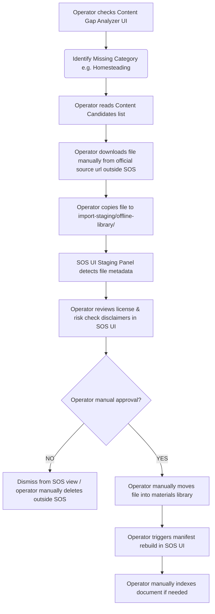

# Manual Import Workflow Design

To ensure copyright compliance and protect Blair's local-first system boundaries, the import system uses a dedicated staging zone. SOS does not auto-download or auto-move items.

## Staging Zone
All candidates prepared for manual import must be placed in:
```text
import-staging/offline-library/
```
This folder is added to `.gitignore` to prevent committing heavy PDF/EPUB binaries to the code repository.

## Operational Flow Chart


## Staging API (`/api/toolkit/staging`)
The server exposes a read-only endpoint that lists files inside `import-staging/offline-library/`:
*   **Security Restrictions**: The endpoint must never read file contents for any staged file. It may only return filename, extension, file size, modified time, and sanitized relative path. It must not open PDFs, EPUBs, ZIMs, ZIPs, executables, media files, or archives. Risk/category/license labels must come from filename heuristics and existing audit metadata, not file content parsing.
*   **Copyright & License Hardening**: The audit and filename heuristics do not prove copyright clearance. To prevent false confidence, `licenseStatus` defaults to `"unknown"`, filename heuristic matches are served as a `suggestedLicenseStatus` with `matchConfidence: "filename_match_only"`, and `verificationStatus` is always `"requires_operator_review"`. Operators must verify source license clearances manually.
*   **Response Payload**:
    ```json
    {
      "stagedFiles": [
        {
          "filename": "FM_21-76_Survival_Manual.pdf",
          "extension": ".pdf",
          "size": 5242880,
          "mtime": 1783132601000,
          "sanitizedPath": "[IMPORT_STAGING]/FM_21-76_Survival_Manual.pdf",
          "detectedCategory": "general_survival",
          "riskCategory": null,
          "licenseStatus": "unknown",
          "suggestedLicenseStatus": "official_free",
          "verificationStatus": "requires_operator_review",
          "matchConfidence": "filename_match_only"
        }
      ]
    }
    ```

## UI Component (`ManualImportQueuePanel.jsx`)
*   Displays a list of staged files.
*   Shows a prominent warning for high-risk files (e.g., medical or chemical references).
*   Displays manual transfer steps:
    > "To complete import, copy this file manually from `import-staging/offline-library/` to your configured materials directory, then click **Rebuild Manifest**."
*   Provides a **Dismiss** button to remove the file representation from the client view (saved in `sos_import_queue_dismissed` in local browser storage).
