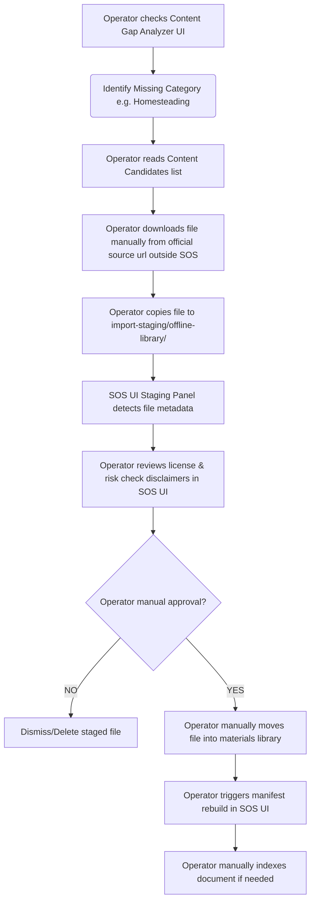

# Manual Import Workflow Design

To ensure copyright compliance and protect Blair's local-first system boundaries, the import system uses a dedicated staging zone. SOS does not auto-download or auto-move items.

## Staging Zone
All candidates prepared for manual import must be placed in:
```text
import-staging/offline-library/
```
This folder is added to `.gitignore` to prevent committing heavy PDF/EPUB binaries to the code repository.

## Operational Flow Chart


## Staging API (`/api/toolkit/staging`)
The server exposes a read-only endpoint that lists files inside `import-staging/offline-library/`:
*   **Security Restrictions**: The endpoint refuses to index, open, or read contents of files containing blocked extensions (e.g. `.exe`, `.msi`, `.dmg`).
*   **Response Payload**:
    ```json
    {
      "stagedFiles": [
        {
          "filename": "FM_21-76_Survival_Manual.pdf",
          "size": 5242880,
          "mtime": 1783132601000,
          "detectedCategory": "general_survival",
          "riskCategory": null,
          "licenseStatus": "official_free",
          "verificationStatus": "verified"
        }
      ]
    }
    ```

## UI Component (`ManualImportQueuePanel.jsx`)
*   Displays a list of staged files.
*   Shows a prominent warning for high-risk files (e.g., medical or chemical references).
*   Displays manual transfer steps:
    > "To complete import, copy this file manually from `import-staging/offline-library/` to your configured materials directory, then click **Rebuild Manifest**."
*   Provides a **Dismiss** button to remove the file representation from the client view (saved in `sos_import_queue_dismissed` in local browser storage).
